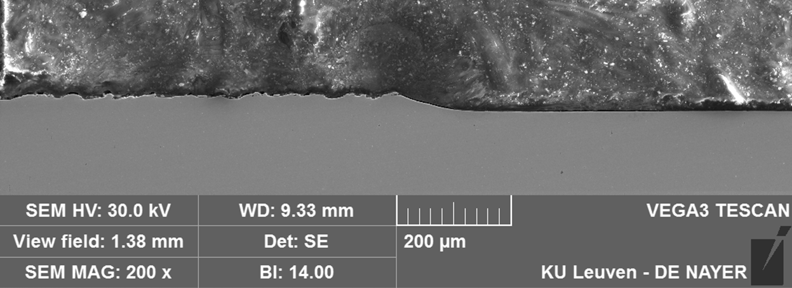
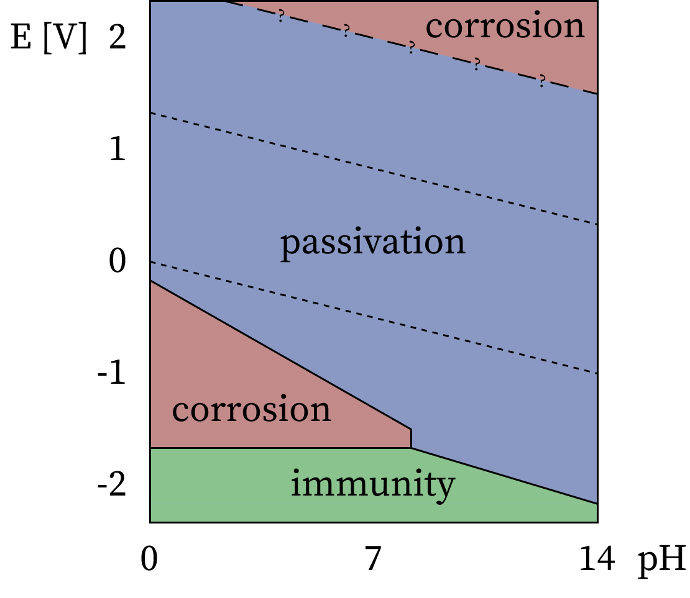

# Introduction 2

Test graphics to use in this book

## D3.js test

::: tip Interactive
Test using [D3.js](https://d3js.org/what-is-d3) framework to render graphics. 
<CustomComponent />
:::

## Plot test
::: tip Interactive
This is a test using [Observable Plot](https://observablehq.com/plot/what-is-plot) to render data.
<PlotComponent />
:::

## Image test
This is a static image as a reference.

